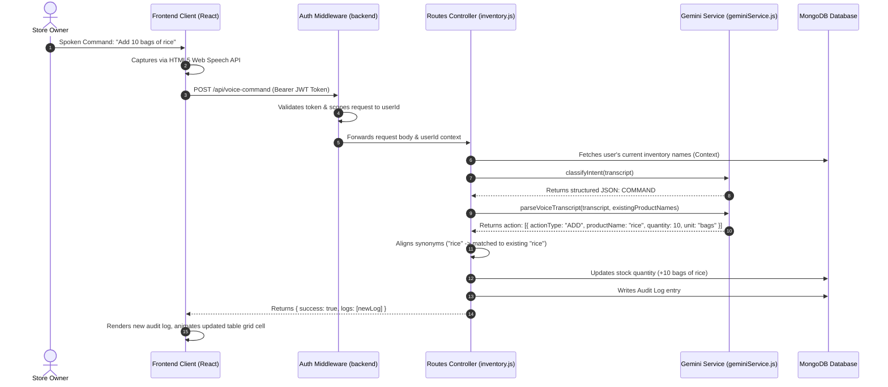

# 🎙️ Vocalize

> **Hands-Free AI Voice Stock Manager for Small Independent Merchants**  
> *Simplify cataloging, prevent inventory leakage, and command your growth with the power of voice.*

[](https://deepmind.google/technologies/gemini/)
[](https://react.dev/)
[](https://nodejs.org/)
[](https://www.mongodb.com/)
[](https://tailwindcss.com/)

---

## 💡 The Problem & The Solution

### The Challenge
Independent retail merchants and mom-and-pop shopkeepers spend hours every evening manually auditing bags, counting stocks, and logging pricing structures. Standard inventory tools are complex, expensive, and require tedious typing on tiny mobile screens. Many merchants resort to paper ledger notebooks, which are easily lost, prone to calculations errors, and isolate their business metrics.

### Our Solution
**Vocalize** bridges physical retail and digital database systems through **natural voice auditing**. The merchant simply taps the microphone and speaks naturally—even using dialect-specific grammar—and our Gemini-powered engine handles intent routing, synonym mapping, stock calculations, and pricing alerts in real time. 

Vocalize converts conversational speech into a structured, auditable retail inventory system—completely hands-free.

---

## ✨ Core Features & Technical Highlights

### 🎙️ 1. Intelligent 2-Step Voice Pipeline
*   **Structured Intent Classifier**: First, the backend uses a forced JSON output schema to classify the spoken transcript as `COMMAND` (transactional actions) or `CONVERSATION` (casual greetings or shop advice).
*   **AI forced Parser**: If marked as a command, Gemini operates under forced function-calling mode (`updateInventory`) to extract structural properties (ActionType, quantity, unit, price) scoped to the merchant's current catalog list.
*   **Offline Fallback Heuristic**: If Gemini is offline, the backend engages a regex-based offline parser that splits clauses by digit intervals and executes calculations locally.

### 🧠 2. Semantic Synonym Alignment
*   **Duplicate Prevention**: Merchants often call the same product by different names (e.g., *"water"*, *"bottles of water"*, or *"water bottle"*). Vocalize checks existing inventory names and maps spoken synonyms contextually using Gemini system instructions.
*   **Fuzzy Matching Safeguard**: Evaluates spelling variances or substring overlap using a secondary containment matching algorithm to guarantee inventory consistency.

### 🔄 3. Multi-Action Chaining & Context Carryover
*   **Compound Command Parsing**: Processes complex compound transcripts (e.g., *"added 10 bags of rice and sold 3 now"*) in a single request.
*   **Context Inheritance**: Automatically carries forward the product name context for sub-clauses that omit it (e.g. mapping the *"sold 3"* directly back to *"rice"*).

### 💬 4. Conversational Price Prompts
*   When a merchant adds stock to a new product with no existing price, the backend flags the operation with `promptForPrice`. The terminal uploader UI blocks and inline-prompts the merchant: *"Enter unit price for [Product]"*. The input is processed and saved instantly.

### ⚖️ 5. Dozen-to-Pieces Unit Normalization
*   Automatically normalizes spoken measurements like `"dozen"` or `"dozens"` (e.g. *"sold 2 dozen pens"*) by multiplying the quantity by 12 and storing it as base units of `"pcs"` to maintain arithmetic accuracy.

### 📂 6. AI Ledger Scanner & Bulk OCR
*   **Multimodal Ledger Processing**: Drag and drop printed/handwritten invoice sheets or ledger images/PDFs (up to 20MB). Gemini parses the document and outputs a structured JSON catalog list.
*   **Inline Editing Grid**: Renders parsed details in a glassmorphic modal grid, allowing merchants to verify and edit items before committing the bulk seed to the database.

### 📊 7. Collapsible Timeline Lazy Loading
*   Optimizes query performance. `/api/logs/summaries` fetches only transaction dates and counts. Detailed log calculations are lazy-loaded from `/api/logs/details/:date` on demand and cached in memory.

### 🔒 8. Sandbox JWT-Token Emulator
*   If Firebase credentials are not found, the frontend simulates accounts inside `localStorage` and generates custom base64 mock JWT tokens. The backend decodes these tokens natively to provide complete, isolated user catalogs for sandbox testing.

---

## 🏗️ System Architecture & Request Flow



---

## 🛠️ Installation & Setup

### Prerequisites
*   [Node.js](https://nodejs.org/) (v18+ recommended)
*   [MongoDB](https://www.mongodb.com/try/download/community) (running locally or a Mongo Atlas URI)
*   [Google Gemini API Key](https://aistudio.google.com/)

### 1. Clone the Repository
```bash
git clone https://github.com/aakashraj7/vocalize.git
cd vocalize
```

### 2. Configure Backend Server
1. Navigate to the `backend` directory:
   ```bash
   cd backend
   npm install
   ```
2. Create a `.env` file in the `backend` folder:
   ```env
   PORT=5000
   MONGO_URI=mongodb://localhost:27017/vocalize
   GEMINI_API_KEY=your_gemini_api_key_here
   # Optional production credentials:
   # FIREBASE_PROJECT_ID=...
   # FIREBASE_CLIENT_EMAIL=...
   # FIREBASE_PRIVATE_KEY=...
   ```
3. Start the backend server in development mode:
   ```bash
   npm run dev
   ```

### 3. Configure Frontend Client
1. Navigate to the `frontend` directory:
   ```bash
   cd ../frontend
   npm install
   ```
2. Start the Vite development server:
   ```bash
   npm run dev
   ```
3. Open `http://localhost:5173` in your browser.

---

## 🎨 Design System

Vocalize implements a high-fidelity **glassmorphic dark-theme** UI built on Tailwind CSS v4:
*   **Typography**: Styled in `Outfit` and `Inter` for headers, with `JetBrains Mono` for terminal widgets and timestamps.
*   **Interactive Graphics**: Right-aligned animated concentric circles spinning slowly around the official floating Vocalize shield logo, highlighted by neon light orbits and drifting particles.
*   **Bouncing Soundwaves**: Dual-mode bouncing visualizers (mini wave in header, large wave in microphone concentric rings).
*   **Responsive Control Bars**: Segmented filters (`ALL`, `IN STOCK`, `LOW STOCK`, `OUT OF STOCK`) with corresponding colored icon indicators.

---

## 🤝 Contributing
Contributions, issues, and feature requests are welcome. Feel free to open a pull request or file an issue on the GitHub tracker!

---

*Made with 💜 for local merchants everywhere.*
